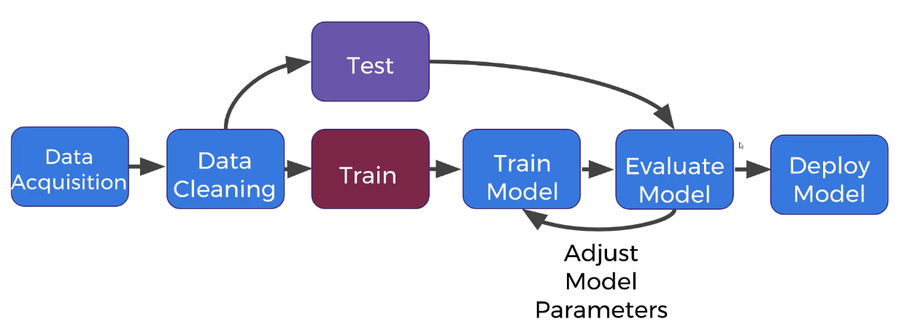

# Complete Guide to TensorFlow for Deep Learning
*Compiled from Notion Export*

---

## Table of Contents

1. [Introduction](#chapter-1-introduction)
2. [Installation and Setup](#chapter-2-installation-and-setup)
3. [What is Machine Learning](#chapter-3-what-is-machine-learning)
4. [Types of Learning Algorithms](#chapter-3-types-of-learning-algorithms)
5. [Model Evaluation Measures](#chapter-3-medidas-de-avaliação-de-modelos)
6. [Crash Course Overview](#chapter-4-crash-course-overview)
7. [Introduction to Neural Networks](#chapter-5-introduction-to-neural-networks)
8. [TensorFlow Basics](#chapter-6-tensorflow-basics)
9. [Convolutional Neural Networks](#chapter-7-convolutional-neural-networks)
10. [Recurrent Neural Networks](#chapter-8-recurrent-neural-networks)
11. [Miscellaneous Topics](#chapter-9-miscellaneous-topics)
12. [AutoEncoders](#chapter-10-autoencoders)
13. [Reinforcement Learning with OpenAI Gym](#chapter-11-reinforcement-learning-with-openai-gym)
14. [GAN - Generative Adversarial Networks](#chapter-12-gan---generative-adversarial-networks)
15. [BONUS](#chapter-13-bonus)

---

## Chapter 1: Introduction

**Instructor:** Jose Portilla, with over 250,000 students on Udemy, specializing in Python, machine learning, data science, and finance. He's also a corporate trainer for Fortune 500 companies.

**Course Focus:** Teaching Google's TensorFlow framework for cutting-edge machine learning techniques.

**Curriculum Overview:**

- **Python Data Science Crash Course:** Covers NumPy, Pandas, Matplotlib, and Scikit-learn.
- **Neural Network Basics:** Perceptrons, activation functions, backpropagation.
- **Deep Learning with TensorFlow:**
    - **Artificial Neural Networks:** Densely connected networks for classification and regression.
    - **Convolutional Neural Networks (CNNs):** For complex image classification.
    - **Recurrent Neural Networks (RNNs):** Including LSTMs and GRUs, for analyzing sequential data (like time series).
    - **Word2Vec:** For word embeddings.
    - **Autoencoders:** For unsupervised learning.
    - **Generative Adversarial Networks (GANs).**
    - **Reinforcement Learning:** Using OpenAI Gym to solve tasks like playing video games.

**Course Features:**

- Clear video explanations.
- Easy-to-understand slides for theoretical aspects.
- Fully coded notebooks for code reference.
- Access to online Q&A forums and a chat room.
- Certificate of completion.
- 30-day money-back guarantee.

### Course Best Practices

To get the most out of this course, keep these tips in mind:

- **Video Playback:** You can adjust video speed up to 2x or slow it down to suit your learning pace. If videos appear blurry, check the gear icon for quality settings; all videos are uploaded in 1080p.
- **Navigation:** Use the **curriculum tab** to easily move between lectures.
- **Platform Issues:** For problems with the Udemy platform (e.g., buffering), contact **support@udemy.com** or submit a request via the Udemy support page. The instructor is not responsible for platform functionality.
- **Reference Materials:** Always **watch the videos and reference the provided notebooks**. The code for deep learning can be complex, so ensure your code matches the notebooks exactly.
- **Course Environment:** Always use the **course environment file** with the provided notebooks. It's highly recommended to run the notebook files directly rather than copying and pasting code to avoid typos and ensure compatibility.

### Where to Find Course Materials

- **Notebooks and Data Files:** All notebooks and data files are available as a **large ZIP file** via a resource link in this lecture and the very next lecture. It's the same file, so download from either.
- **Slides:** The Google Slides used throughout the course are linked in the **first lecture of their respective sections**. For example, to find slides for the Convolutional Neural Networks section, go to the first lecture of that section.

### How to Ask Questions and Get Help

Follow these steps to quickly find answers to your questions:

1. **Verify Your Setup:** Ensure you've run the provided notebook file within the designated environment file (discussed in the installation lecture). All notebook code is checked against this environment, so syntax errors are likely due to typos, incorrect copying/pasting, or not using the provided environment.
2. **Check Videos:** The instructor often preemptively answers questions in the videos. If you have a question about a specific notebook section, check the corresponding video.
3. **Google/Stack Overflow:** For errors or general questions, perform a quick **Google search** or search **Stack Overflow**. These are excellent resources for quickly finding solutions to common issues.
4. **FAQ Lecture:** Search the **Frequently Asked Questions lecture** (the very next lecture) for general course-related or installation questions.
5. **Previous Q&A Posts:** Before posting, search the **course Q&A forums** to see if your question has already been answered by other students or the instructor.
6. **Post to Q&A Forums (if all else fails):** If you still can't find an answer, post your question to the Q&A forums. When posting, be sure to:
    - Clearly state your main error or point of confusion.
    - Link to any resources or Stack Overflow posts you've already reviewed.
    - Include a **video timestamp** (e.g., "minute 12 of lecture 45") if your question relates to a specific part of a lecture.
    - Include a **screenshot** if your error is visual or hard to describe.
    - For installation issues, include details about your **operating system** and the procedure you followed.

### Certification

- For full details on certification, refer to the **Udemy support page resource link**.
- For any issues with your certificate (e.g., delays, name changes), contact **support@udemy.com**. Certification is handled automatically by Udemy.

### Course Curriculum

The course curriculum is structured as follows:

1. **Installation and Setup:** This section will cover installing and setting up Python and TensorFlow.
2. **Machine Learning Overview:** A quick refresher on machine learning concepts.
3. **Crash Course:** This optional section covers **NumPy, Pandas, and Scikit-learn**. If you're already familiar with these libraries (e.g., from a previous course), you can skip this section or review the exercises and solutions to check your understanding.
4. **Introduction to Neural Networks:** This section provides a slow and general introduction to neural networks, building a manual neural network framework in Python that mimics TensorFlow before you actually use TensorFlow.
5. **TensorFlow Sections:** These sections dive into specific network topics (e.g., recurrent neural networks, convolutional neural networks, autoencoders). Each section typically includes:
    - A theory lecture.
    - An implementation example in TensorFlow.
    - An exercise in TensorFlow.

The instructor expresses gratitude to all students for enrolling and looks forward to teaching you.

---

## Chapter 2: Installation and Setup

### Anaconda Installation and Environment Setup

This guide will walk you through setting up your development environment for the course, covering the installation of Anaconda, restoring a specific environment, and a brief introduction to Jupyter Notebook.

#### 1. Downloading and Installing Anaconda

**What is Anaconda?**
Anaconda is a popular distribution of Python for data science, bundling many essential data science packages.

**Download Process:**

- Go to [**anaconda.com/download**](https://anaconda.com/download) in your browser.
- Select your operating system: **Windows**, **macOS**, or **Linux**.
- Click **Download**.

**Installation Steps:**

- **Windows & macOS:** The installer is graphical. Simply follow the on-screen prompts.
- **Linux:** Download the `.sh` installer file. You'll need to run this from your command line using `bash /path/to/installer.sh`. Detailed commands are available on the Anaconda website under "How to Install Anaconda" for Linux.

**Important Note for Installation (PATH Variable):**
During the installation process, you'll be asked whether to **add Anaconda to your PATH environment variable**.

- Anaconda **recommends against this**, as it can interfere with existing Python installations.
- **For this course, you *should* check this option.** This ensures Anaconda is your primary Python distribution for the course. If you don't, you'll have to manually add it to your PATH later.

#### 2. Restoring the Course Environment File

After installing Anaconda, the next step is to restore the specific environment used for this course. This ensures you have all the correct library versions.

**Prerequisites:**

- You should have already downloaded the **course zip file** (from the FAQ or course overview lecture) and **unzipped it** to a known location on your computer. This unzipped folder will contain the `.yml` environment file.

**Opening your Command Line/Terminal:**

- **macOS/Linux:** Open your **Terminal** (search for "terminal").
- **Windows:** Open **Command Prompt** (search for "cmd") or, if you encounter issues, use the **Anaconda Prompt** (search for it). The Anaconda Prompt is particularly useful if you get "Conda not recognized" errors.

**Navigating to the Course Notes Directory:**

- Use the `cd` (change directory) command to navigate to the unzipped course notes folder.
    - To go back up a directory: `cd ..`
    - To enter a directory: `cd folder_name` (you can use **Tab** for auto-completion).
- **Verify you're in the correct directory:** Once you're in the TensorFlow bootcamp folder (or wherever your unzipped course materials are), you should be able to type `TFDL_env.yml` and hit **Tab** to auto-complete the filename. If it doesn't auto-complete, you're likely in the wrong directory.

**Creating the Environment:**

- Run the following command:
    ```bash
    conda env create -f TF_DL_env.yml
    ```
- You may be prompted to confirm installations by typing `y` and pressing Enter. This command will create an environment named `TF Deep Learning` with all the necessary libraries.

**Activating the Environment:**
Once the environment is created, you need to activate it:

- **macOS/Linux:**
    ```bash
    source activate TF_Deep_Learning
    ```
- **Windows:**
    ```bash
    activate TF_Deep_Learning
    ```
- You'll know it's active when you see `(TF_Deep_Learning)` at the beginning of your command line prompt.
- To deactivate the environment: `deactivate`

### Introduction to Jupyter Notebook

Jupyter Notebook is an interactive web application that allows you to create and share documents containing live code, equations, visualizations, and narrative text.

#### Launching Jupyter Notebook

- **Ensure your `TF_Deep_Learning` environment is active.**
- In your command line/terminal, type:
    ```bash
    jupyter notebook
    ```
- This should automatically open a new tab in your web browser. If it doesn't, copy the URL (including the token, if it's your first time) displayed in your terminal and paste it into your browser.

#### Basic Jupyter Notebook Usage

**1. Creating a New Notebook:**

- In the Jupyter Notebook interface, click **New** (usually on the right side).
- Select **Python 3** (or whatever kernel is listed under "Notebook").

**2. Renaming a Notebook:**

- Click on the current name (e.g., "Untitled") at the top of the page.
- Type your desired name and click **Rename**.

**3. Understanding Cells:**

- Jupyter Notebooks are structured into **cells**. You can run code in these cells independently.
- To run a cell: **Shift + Enter**.

**4. Testing TensorFlow Installation:**

- In a new cell, type and run the following code:
    ```python
    import tensorflow as tf
    
    hello = tf.constant("Hello world")
    sess = tf.Session()
    print(sess.run(hello))
    ```
- If everything is working correctly, you should see the output `Hello world`.

**5. Cell Types (Code vs. Markdown):**

- **Code Cells:** These are the default where you write and execute Python code.
- **Markdown Cells:** You can change a cell type to "Markdown" (from the dropdown menu in the toolbar). This allows you to write notes, explanations, and formatted text using Markdown syntax (e.g., headings, italics). Run Markdown cells with **Shift + Enter** to render the text.

**6. Useful Shortcuts and Features:**

- **Tab Completion:** If you have a defined variable (e.g., `s = "a string"`), type `s.` and then press **Tab** to see a list of available methods for that variable. The variable must have been run in a previous cell for this to work.
- **Docstrings (Shift + Tab):** To view the documentation (docstring) for a function, method, or class, place your cursor inside the parentheses of the function/method call and press **Shift + Tab**. Pressing **Shift + Tab** again will expand the docstring.
- **Inserting Cells:**
    - Go to **Insert** in the menu bar.
    - Choose **Insert Cell Above** or **Insert Cell Below**.

---

## Chapter 3: What is Machine Learning

### Types of Machine Learning

There are three main types of machine learning:

- **Supervised Learning:** This type uses **labeled data** to make predictions.
    - **Classification:** Predicts a **categorical label** (e.g., classifying emails as "spam" or "not spam," or predicting "male" or "female" based on height and weight).
    - **Regression:** Predicts a **continuous label** (e.g., predicting house prices based on square footage and number of rooms).
    - **Key takeaway:** In supervised learning, the model learns from historical data where the correct answers (labels) are already known.
- **Unsupervised Learning:** This type works with **unlabeled data** to find hidden patterns or structures.
    - **Clustering:** Groups similar data points together (e.g., grouping dog breeds by height and weight without knowing the specific breed labels).
    - **Key takeaway:** Unsupervised learning doesn't have "correct answers" to learn from, so the goal is to discover inherent relationships within the data. Interpreting the results often requires **domain knowledge**.
- **Reinforcement Learning:** This involves an **agent** learning to make decisions by trial and error in an **environment** to maximize a **reward metric**.
    - **Components:**
        - **Agent:** The learner or decision-maker.
        - **Environment:** What the agent interacts with (e.g., a video game, a street for a self-driving car).
        - **Actions:** What the agent can do in the environment (e.g., pressing buttons, braking, accelerating).
    - **Process:** The agent chooses actions to maximize a specified reward over time, learning the best "policy" (strategy) to achieve its goal.

### General Machine Learning Process (Supervised Learning Focus)

The typical machine learning workflow, especially for supervised learning, involves several key steps:



1. **Acquire Data:** Collect the relevant data for your task (e.g., past house sales, images of cats and dogs).
2. **Clean and Organize Data:** This is a crucial and often time-consuming step. It involves preparing the data for the model, which might include:
    - Reducing image sizes.
    - Normalizing numerical data.
    - Handling missing values.
3. **Train-Test Split:** Divide your labeled data into two sets:
    - **Training Set:** Used to train the machine learning model (e.g., 70% of the data).
    - **Testing Set:** Used to evaluate the model's performance on unseen data to ensure fairness and prevent "cheating" (e.g., 30% of the data).
4. **Train Model:** Fit your chosen machine learning model (like a neural network using TensorFlow) to the **training data only**.
5. **Evaluate Model:** Assess the model's performance using the **test data**. This helps you understand how well the model generalizes to new information.
6. **Adjust Model Parameters:** Based on the evaluation, refine the model's settings (parameters) to improve its performance. This is an iterative process where you cycle between training, evaluating, and adjusting.
7. **Deploy Model:** Once satisfied with the model's performance, deploy it to make predictions on new, incoming data in a real-world scenario.

Unsupervised training has no test-train split, cause there is no prior labels.

### Holdout Data Set (Evaluation Set)


Sometimes, in addition to a train-test split, a **holdout set** is used:

- The data is split into **training, testing, and holdout sets**.
- The **training and testing sets** are used for iterative training and parameter adjustment, as described above.
- The **holdout set** is kept completely separate and is only used *once* at the very end to get a final, unbiased assessment of the model's expected performance in deployment. Once evaluated against the holdout set, you typically **do not go back and adjust the model parameters**.

### Model Evaluation Metrics

The way you evaluate a machine learning model depends on the type of problem:

- **Supervised Learning (Classification):**
    - **Accuracy:** The most common and straightforward metric, calculated as the number of correctly classified samples divided by the total number of samples.
    - Other metrics include **recall** and **precision**.
- **Supervised Learning (Regression):**
    - Metrics measure how far off, on average, the predictions are from the true continuous values.
    - Examples include **Mean Absolute Error (MAE)**, **Mean Squared Error (MSE)**, and **Root Mean Squared Error (RMSE)**.
- **Unsupervised Learning:**
    - Evaluation is **more challenging** because there are no correct labels to compare against.
    - Metrics like **cluster homogeneity** or the **Rand index** can be used, but interpreting results often requires human judgment and domain expertise, as good metrics don't always mean visually "correct" groupings.
- **Reinforcement Learning:**
    - Evaluation is typically **more obvious** as it's directly tied to the built-in reward metric (e.g., the score in a video game).

---

## Chapter 3: Types of Learning Algorithms

**Resumo:**

- **Supervisionado**
    - Dados com labels pré-definidas
    - Aprendizado do mapeamento
    - Classificação e regressão
- **Não supervisionado**
    - Dados não rotulados
    - Descoberta de padrões
    - Agrupamento, associação e redução de dimensionalidade
- **Reforço**
    - Dados não rotulados
    - Maximização de função
        - Recompensa e penalidade

O Machine Learning (Aprendizado de Máquina) é uma área da Inteligência Artificial que permite que sistemas aprendam a partir de dados, identifiquem padrões e tomem decisões com o mínimo de intervenção humana. Existem três paradigmas principais no aprendizado de máquina: **Aprendizado Supervisionado**, **Aprendizado Não Supervisionado** e **Aprendizado por Reforço**.

### 1. Aprendizado Supervisionado (Supervised Learning)

**O que é:** O aprendizado supervisionado é o tipo mais comum de Machine Learning. Nele, o algoritmo é treinado com um conjunto de dados que já possui "rótulos" ou "saídas" conhecidas. É como ensinar uma criança com exemplos: "Este é um cachorro, este é um gato, este é um cachorro..." O modelo aprende a mapear as entradas (dados) para as saídas (rótulos) a partir desses exemplos rotulados. Uma vez treinado, o modelo pode prever as saídas para novos dados não vistos.

**Como funciona:**

- **Dados Rotulados:** Requer um conjunto de dados onde cada exemplo de entrada está associado a uma saída correta.
- **Aprendizado do Mapeamento:** O algoritmo busca aprender uma função que mapeie as entradas para as saídas.
- **Previsão:** Uma vez treinado, o modelo é capaz de prever as saídas para novas entradas.

**Tipos de problemas que resolve:**

- **Classificação:** Prever uma categoria discreta (ex: spam/não spam, doença/não doença).
- **Regressão:** Prever um valor contínuo (ex: preço de uma casa, temperatura).

**Exemplos:**

- **Detecção de Spam:** O sistema é treinado com e-mails rotulados como "spam" ou "não spam". Ele aprende a identificar características de spam (palavras-chave, remetente, etc.) e, em seguida, classifica novos e-mails.
- **Previsão de Preços de Imóveis:** Com base em dados históricos de casas (tamanho, número de quartos, localização, etc.) e seus respectivos preços, o modelo aprende a prever o preço de uma nova casa.
- **Diagnóstico Médico:** Prever a probabilidade de uma doença com base em sintomas, idade, resultados de exames de um paciente.
- **Reconhecimento de Imagens:** Treinar um modelo para identificar objetos específicos (carros, pessoas, etc.) em imagens, após serem mostradas inúmeras imagens com esses objetos rotulados.

### 2. Aprendizado Não Supervisionado (Unsupervised Learning)

**O que é:** No aprendizado não supervisionado, o algoritmo recebe dados **não rotulados**. O objetivo não é prever uma saída específica, mas sim encontrar padrões ocultos, estruturas ou relações dentro dos dados. É como dar a uma criança um monte de objetos e pedir para ela organizá-los sem dar nenhuma instrução prévia.

**Como funciona:**

- **Dados Não Rotulados:** Não há saídas pré-definidas ou rótulos nos dados de treinamento.
- **Descoberta de Padrões:** O algoritmo busca encontrar agrupamentos, associações ou reduzir a complexidade dos dados.
- **Nenhuma Orientação Externa:** O aprendizado acontece sem intervenção humana para corrigir ou validar as saídas.

**Tipos de problemas que resolve:**

- **Agrupamento (Clustering):** Agrupar pontos de dados semelhantes em "clusters" ou grupos.
- **Associação:** Descobrir regras que descrevem a relação entre diferentes variáveis nos dados.
- **Redução de Dimensionalidade:** Simplificar dados com muitas variáveis, encontrando representações mais compactas.

**Exemplos:**

- **Segmentação de Clientes:** Agrupar clientes de uma empresa com base em seu comportamento de compra, dados demográficos ou histórico de navegação, para que a empresa possa criar campanhas de marketing mais direcionadas.
- **Sistemas de Recomendação:** Em plataformas como Netflix ou Amazon, o sistema pode agrupar usuários com gostos semelhantes ou produtos frequentemente comprados juntos para recomendar itens relevantes (ex: "quem comprou X também comprou Y").
- **Detecção de Anomalias:** Identificar comportamentos incomuns em um conjunto de dados, como transações financeiras fraudulentas ou falhas em equipamentos industriais, onde os dados anormais se destacam dos padrões normais.
- **Organização de Documentos:** Agrupar documentos de texto com temas semelhantes, mesmo que não haja categorias pré-definidas.

### 3. Aprendizado por Reforço (Reinforcement Learning)

**O que é:** O aprendizado por reforço é um tipo de aprendizado onde um "agente" aprende a tomar decisões sequenciais em um "ambiente" para maximizar uma "recompensa". Ele aprende por tentativa e erro, recebendo feedback na forma de recompensas (por ações boas) ou penalidades (por ações ruins). Não há um conjunto de dados rotulados pré-definido; o agente aprende através da interação com o ambiente.

**Como funciona:**

- **Agente:** O tomador de decisões (ex: um robô, um algoritmo de jogo).
- **Ambiente:** O contexto onde o agente atua (ex: um jogo, o mundo real).
- **Estado:** A situação atual do ambiente.
- **Ação:** O que o agente faz no ambiente.
- **Recompensa:** Feedback positivo ou negativo que o agente recebe após uma ação.
- **Política:** A estratégia que o agente desenvolve para escolher ações em diferentes estados.

**Exemplos:**

- **Jogos (AlphaGo, xadrez):** Um agente de IA aprende a jogar xadrez ou Go. Ele experimenta diferentes movimentos e recebe uma recompensa se ganhar o jogo e uma penalidade se perder. Com milhões de simulações, ele otimiza sua estratégia para maximizar as vitórias.
- **Carros Autônomos:** Um carro autônomo aprende a dirigir navegando em um ambiente (real ou simulado). Ele recebe recompensas por chegar ao destino com segurança e no tempo certo, e penalidades por colisões ou desvios de rota.
- **Robótica:** Um robô aprende a andar, manipular objetos ou completar tarefas em um ambiente físico. Ele recebe recompensas por realizar a tarefa corretamente e penalidades por erros.
- **Otimização de Processos Industriais:** Um sistema de IA pode aprender a otimizar a operação de uma fábrica, ajustando parâmetros para maximizar a produção e minimizar o consumo de energia, recebendo recompensas por bons resultados.

### Tabela Comparativa

| Característica | Aprendizado Supervisionado | Aprendizado Não Supervisionado | Aprendizado por Reforço |
| --- | --- | --- | --- |
| **Dados** | Rotulados (entrada-saída conhecida) | Não Rotulados (apenas entradas) | Não Rotulados (apenas interações e recompensas) |
| **Objetivo** | Prever saídas para novos dados | Encontrar padrões, estruturas ou relações ocultas | Aprender a tomar decisões para maximizar recompensas |
| **Feedback** | Direto (rótulos corretos fornecidos) | Indireto (nenhum rótulo; o algoritmo se auto-organiza) | Baseado em recompensas/penalidades de ações sequenciais |
| **Intervenção Humana** | Alta (para rotular os dados) | Baixa (para interpretar os padrões descobertos) | Variável (para definir as recompensas e o ambiente) |
| **Exemplos de Tarefas** | Classificação, Regressão | Agrupamento, Redução de Dimensionalidade, Regras de Associação | Jogos, Robótica, Carros Autônomos |

---

## Chapter 3: Medidas de Avaliação de Modelos

Em Machine Learning, especialmente em problemas de classificação, **accuracy (acurácia), recall (sensibilidade ou revocação) e precision (precisão)** são métricas cruciais para avaliar o desempenho de um modelo. Elas nos dão diferentes perspectivas sobre o quão bem o modelo está fazendo suas previsões.

Para entender essas métricas, é fundamental conhecer os quatro resultados possíveis de uma classificação:

- **Verdadeiro Positivo (VP):** O modelo previu corretamente a classe positiva. Ex: O modelo previu que a imagem era um cachorro, e de fato era um cachorro.
- **Verdadeiro Negativo (VN):** O modelo previu corretamente a classe negativa. Ex: O modelo previu que a imagem não era um cachorro, e de fato não era um cachorro.
- **Falso Positivo (FP):** O modelo previu a classe positiva incorretamente. Ex: O modelo previu que a imagem era um cachorro, mas na verdade era um gato. (Erro Tipo I)
- **Falso Negativo (FN):** O modelo previu a classe negativa incorretamente. Ex: O modelo previu que a imagem não era um cachorro, mas na verdade era um cachorro. (Erro Tipo II)

Esses termos são frequentemente organizados em uma **matriz de confusão**, que é uma tabela que resume o desempenho do modelo em relação aos resultados reais e previstos.

### Accuracy (Acurácia)

A **acurácia** mede a proporção de todas as previsões que foram corretas, tanto positivas quanto negativas, em relação ao total de previsões. É a métrica mais intuitiva e fácil de entender.

**Fórmula:**
```
Accuracy = (VP + VN) / (VP + VN + FP + FN)
```

**Interpretação:**
Uma acurácia de 90% significa que o modelo acertou 90 em cada 100 previsões.

**Quando usar:**
A acurácia é uma boa métrica quando o **conjunto de dados é balanceado**, ou seja, quando há um número aproximadamente igual de exemplos para cada classe.

**Limitações:**
Em conjuntos de dados desbalanceados (onde uma classe é muito mais frequente que a outra), a acurácia pode ser enganosa. Por exemplo, se em um problema de detecção de fraude, 99% das transações são legítimas e 1% são fraudulentas, um modelo que simplesmente classifica todas as transações como "legítimas" teria 99% de acurácia, mas seria inútil para detectar fraudes.

### Recall (Sensibilidade ou Revocação)

O **recall**, também conhecido como **taxa de verdadeiros positivos (TVP)** ou **sensibilidade**, mede a proporção de todas as instâncias positivas *reais* que foram corretamente identificadas pelo modelo. Em outras palavras, ele responde à pergunta: "De todas as coisas que *realmente* eram positivas, quantas o modelo conseguiu capturar?"

**Fórmula:**
```
Recall = VP / (VP + FN)
```

**Interpretação:**
Um recall de 95% para a classe "fraude" significa que o modelo conseguiu identificar 95% de todas as transações fraudulentas reais.

**Quando usar:**
O recall é crucial quando o **custo de um falso negativo é alto**. Ou seja, quando é muito importante não perder nenhuma instância positiva real.

**Exemplos de uso:**

- **Diagnóstico médico (doenças graves):** É preferível ter alguns falsos positivos (pessoas saudáveis classificadas como doentes, que farão exames adicionais) do que falsos negativos (pessoas doentes classificadas como saudáveis, que não receberão tratamento).
- **Detecção de fraude:** Não queremos perder transações fraudulentas, mesmo que isso signifique investigar algumas transações legítimas.
- **Sistemas de segurança (detecção de intrusos):** É vital detectar todos os intrusos, mesmo que ocasionalmente soe um alarme falso.

### Precision (Precisão)

A **precision** mede a proporção de todas as previsões positivas do modelo que foram *realmente* positivas. Em outras palavras, ela responde à pergunta: "Das coisas que o modelo classificou como positivas, quantas estavam *corretas*?"

**Fórmula:**
```
Precision = VP / (VP + FP)
```

**Interpretação:**
Uma precision de 80% para a classe "spam" significa que, de todos os e-mails que o modelo classificou como spam, 80% eram de fato spam.

**Quando usar:**
A precision é importante quando o **custo de um falso positivo é alto**. Ou seja, quando é fundamental que as previsões positivas do modelo sejam muito confiáveis.

**Exemplos de uso:**

- **Filtro de spam em e-mails:** Não queremos que e-mails importantes (não-spam) sejam classificados como spam (falsos positivos), pois o usuário pode perdê-los. É preferível que alguns spams passem (falsos negativos) do que e-mails importantes sejam bloqueados.
- **Recomendações de produtos:** Se um sistema recomenda produtos que não interessam ao usuário (falsos positivos), isso pode levar à frustração e à perda de confiança no sistema.
- **Processos de fabricação (controle de qualidade):** Se o modelo classifica produtos bons como defeituosos (falsos positivos), isso gera desperdício.

### Trade-off entre Precision e Recall

É comum haver um **trade-off** entre precision e recall. Melhorar um geralmente significa piorar o outro. Por exemplo:

- Um modelo que é muito conservador e faz pouquíssimas previsões positivas terá alta precision (quase todas as previsões positivas serão corretas), mas pode ter baixo recall (perderá muitas instâncias positivas reais).
- Um modelo que é muito agressivo e tenta capturar todas as instâncias positivas possíveis terá alto recall, mas pode ter baixa precision (muitas de suas previsões positivas serão falsos positivos).

A escolha da métrica mais importante (ou a combinação delas, como o **F1-Score**, que é a média harmônica de precision e recall) depende do contexto do problema e das consequências de cada tipo de erro (falso positivo vs. falso negativo).

Ao avaliar um modelo de Machine Learning, é fundamental analisar essas métricas em conjunto com a matriz de confusão para ter uma compreensão completa do seu desempenho e decidir qual métrica otimizar com base nos objetivos do negócio.

---

## Chapter 4: Crash Course Overview

*This chapter provides an overview of the Python data science crash course covering NumPy, Pandas, Matplotlib, and Scikit-learn.*

---

## Chapter 5: Introduction to Neural Networks

*This chapter provides a slow and general introduction to neural networks, building a manual neural network framework in Python that mimics TensorFlow before you actually use TensorFlow.*

---

## Chapter 6: TensorFlow Basics

*This chapter covers the fundamentals of the TensorFlow framework.*

---

## Chapter 7: Convolutional Neural Networks

*This chapter covers Convolutional Neural Networks (CNNs) for complex image classification.*

---

## Chapter 8: Recurrent Neural Networks

*This chapter covers Recurrent Neural Networks (RNNs), including LSTMs and GRUs, for analyzing sequential data like time series.*

---

## Chapter 9: Miscellaneous Topics

*This chapter covers various miscellaneous topics in deep learning.*

---

## Chapter 10: AutoEncoders

*This chapter covers AutoEncoders for unsupervised learning.*

---

## Chapter 11: Reinforcement Learning with OpenAI Gym

*This chapter covers Reinforcement Learning using OpenAI Gym to solve tasks like playing video games.*

---

## Chapter 12: GAN - Generative Adversarial Networks

*This chapter covers Generative Adversarial Networks (GANs).*

---

## Chapter 13: BONUS

*This chapter contains bonus material and additional resources.*

---

## Course Summary

This comprehensive guide covers the complete journey from basic machine learning concepts to advanced deep learning techniques using TensorFlow. The course is structured to provide both theoretical understanding and practical implementation skills, making it suitable for both beginners and intermediate practitioners in the field of machine learning and deep learning.

### Key Learning Outcomes:

1. **Fundamental Understanding:** Solid grasp of machine learning types and evaluation metrics
2. **Technical Setup:** Proper environment configuration with Anaconda and Jupyter
3. **Practical Skills:** Hands-on experience with TensorFlow and various neural network architectures
4. **Advanced Techniques:** Exposure to cutting-edge methods like GANs and reinforcement learning
5. **Best Practices:** Industry-standard approaches to model development and evaluation

### Next Steps:

After completing this course, learners should be well-equipped to:
- Implement neural networks for various problem domains
- Evaluate and optimize model performance
- Apply deep learning to real-world scenarios
- Continue learning advanced topics in AI and machine learning

---

*This document compiles all available content from the Notion export. Some chapters may have limited content as they primarily contain practical exercises and code examples not included in this text-based compilation.* 