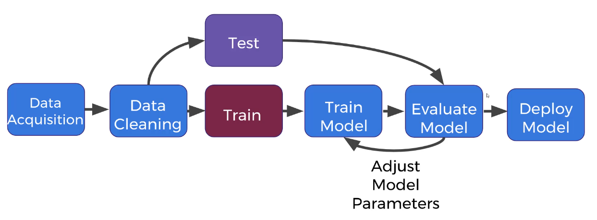

# What is Machine Learning

Chapter: 3

## Types of Machine Learning

There are three main types of machine learning:

- **Supervised Learning:** This type uses **labeled data** to make predictions.
    - **Classification:** Predicts a **categorical label** (e.g., classifying emails as "spam" or "not spam," or predicting "male" or "female" based on height and weight).
    - **Regression:** Predicts a **continuous label** (e.g., predicting house prices based on square footage and number of rooms).
    - **Key takeaway:** In supervised learning, the model learns from historical data where the correct answers (labels) are already known.
- **Unsupervised Learning:** This type works with **unlabeled data** to find hidden patterns or structures.
    - **Clustering:** Groups similar data points together (e.g., grouping dog breeds by height and weight without knowing the specific breed labels).
    - **Key takeaway:** Unsupervised learning doesn't have "correct answers" to learn from, so the goal is to discover inherent relationships within the data. Interpreting the results often requires **domain knowledge**.
- **Reinforcement Learning:** This involves an **agent** learning to make decisions by trial and error in an **environment** to maximize a **reward metric**.
    - **Components:**
        - **Agent:** The learner or decision-maker.
        - **Environment:** What the agent interacts with (e.g., a video game, a street for a self-driving car).
        - **Actions:** What the agent can do in the environment (e.g., pressing buttons, braking, accelerating).
    - **Process:** The agent chooses actions to maximize a specified reward over time, learning the best "policy" (strategy) to achieve its goal.

---

## General Machine Learning Process (Supervised Learning Focus)

The typical machine learning workflow, especially for supervised learning, involves several key steps:

1. **Acquire Data:** Collect the relevant data for your task (e.g., past house sales, images of cats and dogs).
2. **Clean and Organize Data:** This is a crucial and often time-consuming step. It involves preparing the data for the model, which might include:
    - Reducing image sizes.
    - Normalizing numerical data.
    - Handling missing values.
3. **Train-Test Split:** Divide your labeled data into two sets:
    - **Training Set:** Used to train the machine learning model (e.g., 70% of the data).
    - **Testing Set:** Used to evaluate the model's performance on unseen data to ensure fairness and prevent "cheating" (e.g., 30% of the data).
4. **Train Model:** Fit your chosen machine learning model (like a neural network using TensorFlow) to the **training data only**.
5. **Evaluate Model:** Assess the model's performance using the **test data**. This helps you understand how well the model generalizes to new information.
6. **Adjust Model Parameters:** Based on the evaluation, refine the model's settings (parameters) to improve its performance. This is an iterative process where you cycle between training, evaluating, and adjusting.
7. **Deploy Model:** Once satisfied with the model's performance, deploy it to make predictions on new, incoming data in a real-world scenario.

Unsupervised training has no test-train split, cause there is no prior labels.

---

## Holdout Data Set (Evaluation Set)

Sometimes, in addition to a train-test split, a **holdout set** is used:

- The data is split into **training, testing, and holdout sets**.
- The **training and testing sets** are used for iterative training and parameter adjustment, as described above.
- The **holdout set** is kept completely separate and is only used *once* at the very end to get a final, unbiased assessment of the model's expected performance in deployment. Once evaluated against the holdout set, you typically **do not go back and adjust the model parameters**.

---

## Model Evaluation Metrics

The way you evaluate a machine learning model depends on the type of problem:

- **Supervised Learning (Classification):**
    - **Accuracy:** The most common and straightforward metric, calculated as the number of correctly classified samples divided by the total number of samples.
    - Other metrics include **recall** and **precision**.
- **Supervised Learning (Regression):**
    - Metrics measure how far off, on average, the predictions are from the true continuous values.
    - Examples include **Mean Absolute Error (MAE)**, **Mean Squared Error (MSE)**, and **Root Mean Squared Error (RMSE)**.
- **Unsupervised Learning:**
    - Evaluation is **more challenging** because there are no correct labels to compare against.
    - Metrics like **cluster homogeneity** or the **Rand index** can be used, but interpreting results often requires human judgment and domain expertise, as good metrics don't always mean visually "correct" groupings.
- **Reinforcement Learning:**
    - Evaluation is typically **more obvious** as it's directly tied to the built-in reward metric (e.g., the score in a video game).